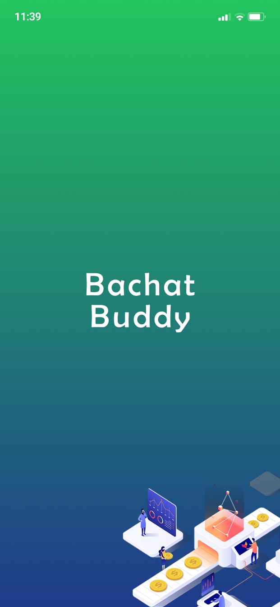
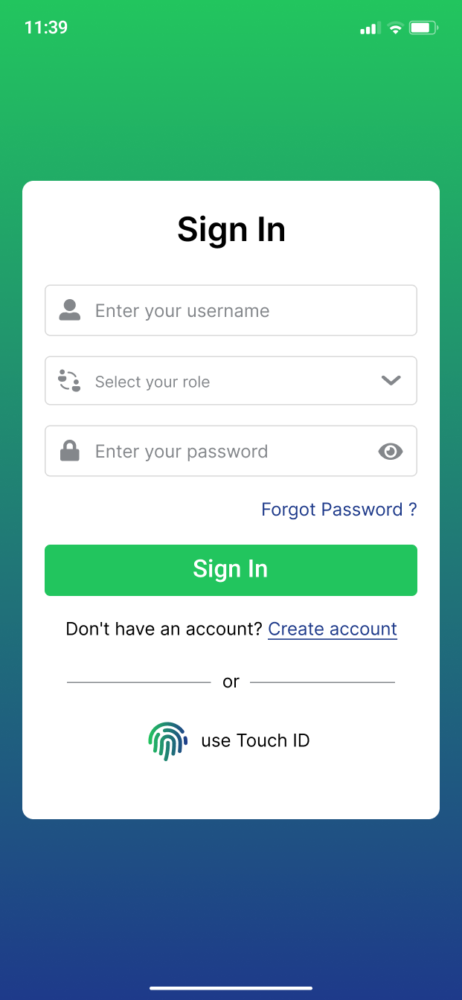
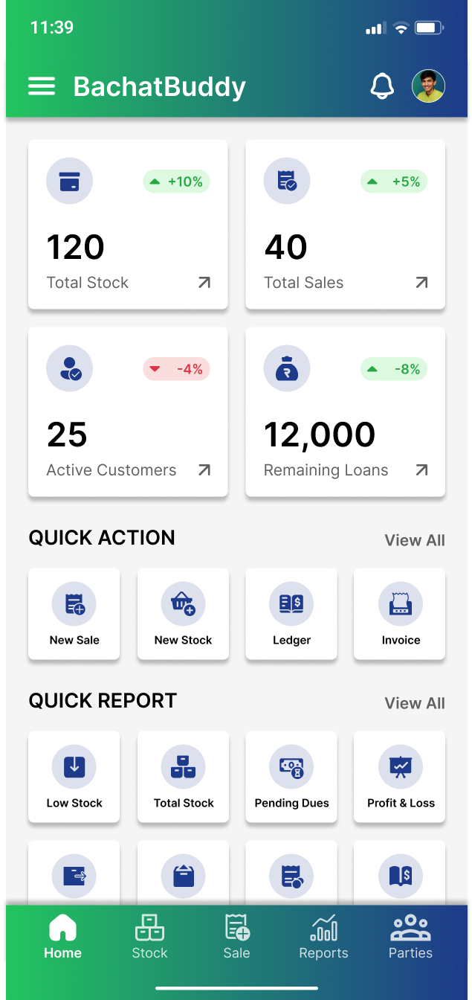
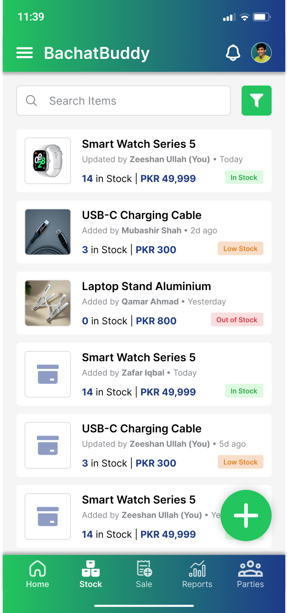
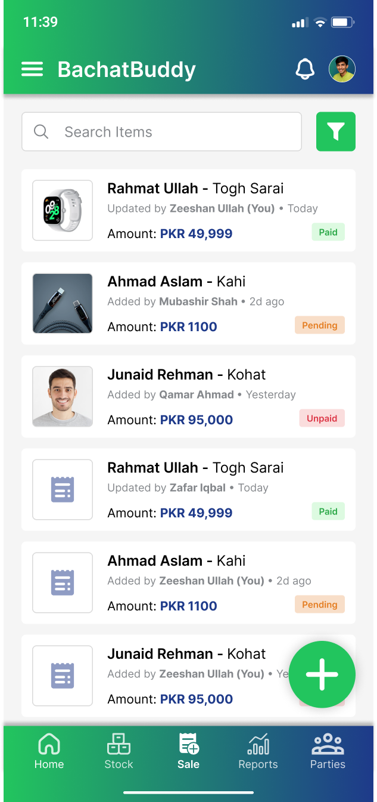
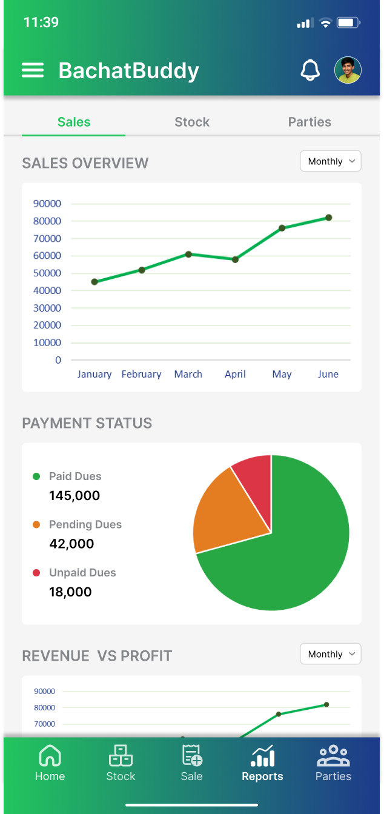
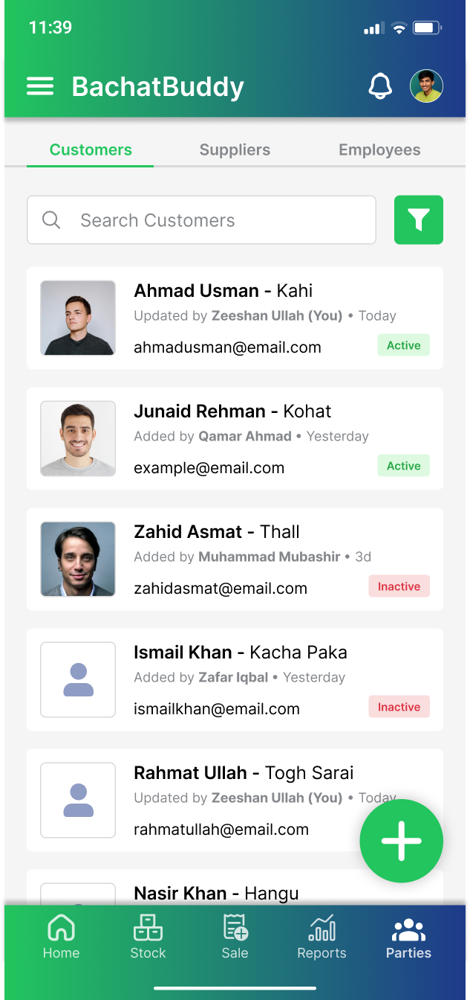
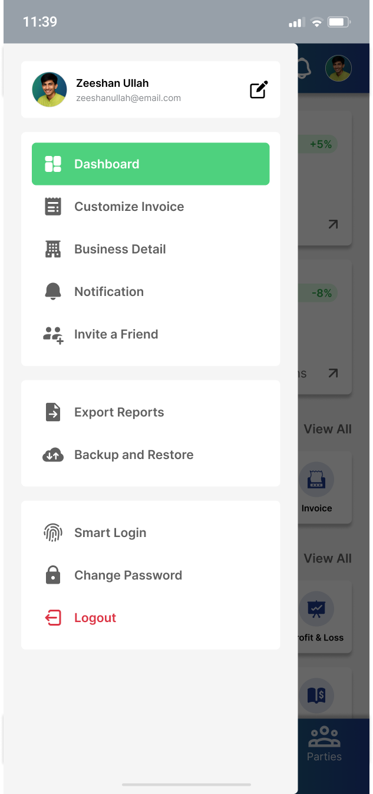

<div align="center">


# BachatBuddy

**A Digital Business Tracking System for Small Business Owners**

[](https://reactnative.dev/)
[](https://expo.dev/)
[](https://nodejs.org/)
[](https://expressjs.com/)
[](https://www.mongodb.com/)
[](https://www.typescriptlang.org/)

*Final Year Project — BS Computer Science*

</div>

---

## About

BachatBuddy is a mobile app I built for my Final Year Project. The idea came from seeing small shop owners around me still using paper registers to track their sales and stock. This app replaces that with a simple digital system they can use on their phone.

It covers everything a small business needs — stock management, invoices, customer/supplier records, and business reports with charts.

---

## Features

- **Authentication** — Sign up, sign in, forgot password, and fingerprint login
- **Dashboard** — Overview of stock, sales, customers, and loans with trend indicators
- **Stock Management** — Add products manually or via QR/barcode scanner, track quantities and prices
- **Sales & Invoices** — Create invoices, track payment status (Paid / Pending / Unpaid)
- **Parties** — Manage customers, suppliers, and employees separately
- **Reports** — Sales charts, payment status pie chart, revenue vs profit graph, stock reports
- **Notifications** — In-app alerts for low stock and payment reminders
- **Settings** — Profile edit, business details, export records as PDF/CSV, backup & restore

---

## Tech Stack

### Mobile App (Frontend)
| | |
|---|---|
| Framework | React Native with Expo |
| Navigation | Expo Router (file-based) |
| Styling | NativeWind (Tailwind CSS for React Native) |
| State Management | Zustand + React Query |
| Forms & Validation | React Hook Form + Zod |
| Animations | React Native Reanimated |
| Charts | React Native Gifted Charts |
| Auth Storage | Expo Secure Store |
| Camera / Scanner | Expo Camera + Barcode Scanner |
| Biometrics | Expo Local Authentication |

### Backend
| | |
|---|---|
| Runtime | Node.js |
| Framework | Express.js |
| Database | MongoDB with Mongoose |
| Authentication | JWT (JSON Web Tokens) |
| Password Hashing | bcrypt |
| File Uploads | Multer |
| Environment Config | dotenv |

---

## Project Structure

```
bachat-buddy/
│
├── mobile/                     # React Native Expo app
│   ├── app/                    # Expo Router screens
│   │   ├── (auth)/             # Login, signup, fingerprint
│   │   ├── (app)/              # Main app screens
│   │   │   ├── dashboard/
│   │   │   ├── stock/
│   │   │   ├── sales/
│   │   │   ├── reports/
│   │   │   └── parties/
│   │   └── (modal)/            # Drawer, notifications, profile
│   └── src/
│       ├── components/         # Reusable UI components
│       ├── features/           # Feature-based modules
│       ├── store/              # Zustand stores
│       ├── services/           # API calls
│       ├── hooks/              # Custom hooks
│       ├── utils/              # Helper functions
│       └── constants/          # Theme, routes, config
│
└── backend/                    # Node.js + Express API
    ├── controllers/            # Route handler functions
    ├── models/                 # Mongoose schemas
    ├── routes/                 # API route definitions
    ├── middleware/             # Auth, error handling
    ├── utils/                  # Helper functions
    └── server.js               # Entry point
```

---

## Getting Started

### Requirements
- Node.js v18+
- MongoDB (local or Atlas)
- Expo Go app on your phone

### Backend Setup

```bash
cd backend
npm install
cp .env.example .env
```

Fill in your `.env`:
```env
PORT=5000
MONGO_URI=mongodb://localhost:27017/bachatbuddy
JWT_SECRET=your_secret_key
```

```bash
npm run dev
```

### Mobile App Setup

```bash
cd mobile
npm install
cp .env.example .env
```

Fill in your `.env`:
```env
EXPO_PUBLIC_API_URL=http://192.168.x.x:5000/api
```

```bash
npx expo start
```

Scan the QR code with Expo Go on your phone.

---

## API Overview

| Method | Endpoint | Description |
|--------|----------|-------------|
| POST | `/api/auth/register` | Register new user |
| POST | `/api/auth/login` | Login and get token |
| GET | `/api/products` | Get all products |
| POST | `/api/products` | Add new product |
| PUT | `/api/products/:id` | Update product |
| DELETE | `/api/products/:id` | Delete product |
| GET | `/api/invoices` | Get all invoices |
| POST | `/api/invoices` | Create invoice |
| GET | `/api/customers` | Get all customers |
| GET | `/api/reports/sales` | Sales analytics data |

---

## Screenshots

> 63 screens designed in Figma

| Splash | Sign In | Dashboard | Stock |
|--------|---------|-----------|-------|
|  |  |  |  |

| Sales | Reports | Customers | Menu |
|-------|---------|-----------|------|
|  |  |  |  |

📐 [View Figma Design](https://www.figma.com/design/TvgoWSGLuowppWBeGbY4ZE/BachatBuddy--%7C-Mobile-App)

---

## Roadmap

- [x] Figma UI/UX Design (46 screens)
- [x] Project architecture planning
- [ ] Backend API (Node.js + Express + MongoDB)
- [ ] Authentication (JWT + Biometric)
- [ ] Dashboard
- [ ] Stock Management
- [ ] Sales & Invoices
- [ ] Parties (Customers, Suppliers, Employees)
- [ ] Reports & Analytics
- [ ] Export & Backup
- [ ] Testing & final polish

---

## Developer

**Zeeshan Ullah**
BS Computer Science Student

---

<div align="center">

*BachatBuddy — Apna Karobar, Apni Marzi*
*(Your Business, Your Way)*

⭐ **Star this repo if it helped you!** ⭐

</div>
